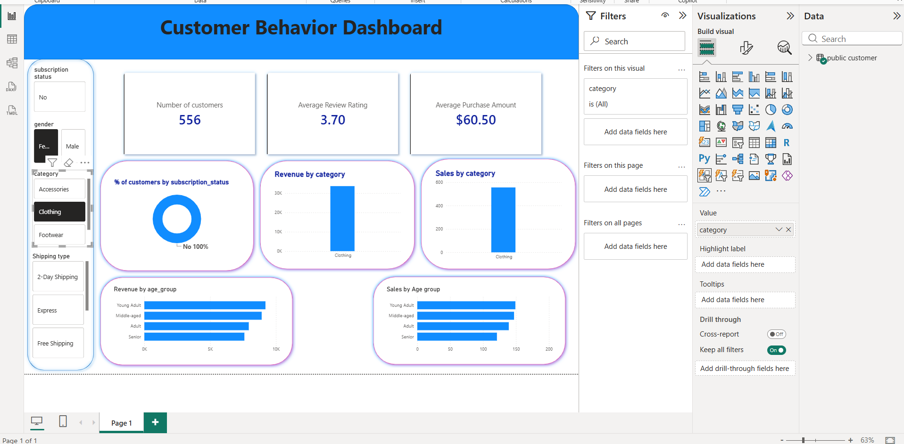

# 🛍️ Customer Shopping Behavior Analysis

An end-to-end Data Analytics project that analyzes customer shopping behavior using **Python**, **PostgreSQL**, **SQL**, and **Power BI**. The project demonstrates the complete analytics workflow—from raw data preprocessing to interactive dashboard creation—providing actionable business insights into customer purchasing patterns.

---

## 📌 Project Overview

This project focuses on analyzing customer shopping behavior to understand purchasing trends, customer demographics, subscription patterns, and revenue generation.

The workflow includes:

- Cleaning and preprocessing raw customer data using Python.
- Loading the cleaned data into PostgreSQL.
- Performing business analysis using SQL.
- Creating an interactive Power BI dashboard to visualize key insights.

---

## 🚀 Project Workflow

```text
Raw Customer Shopping Dataset (CSV)
                │
                ▼
Python Data Cleaning & Feature Engineering
                │
                ▼
Load Cleaned Data into PostgreSQL
                │
                ▼
Business Analysis using SQL
                │
                ▼
Interactive Power BI Dashboard
                │
                ▼
Business Insights
```

---

# 🛠️ Tech Stack

| Technology : Purpose |
|------------|---------|
| Python : Data Cleaning & Preprocessing |
| Pandas : Data Manipulation |
| PostgreSQL : Database |
| SQL : Business Analysis |
| Power BI : Data Visualization |
| Excel/CSV : Source Dataset |

---

# 📂 Project Structure

```text
Customer-Shopping-Behavior-Analysis
│
├── Dataset
│   └── Customer_Shopping_Behavior.csv
│
├── Python
│   └── Python_Analysis.ipynb
│
├── SQL
│   └── Customer_Queries.sql
│
├── Power BI
│   └── Customer_Behaviour_Dashboard.pbix
│
├── Images
│   └── dashboard.png
│
├── README.md
└── .gitignore
```

---

# 📊 Dataset Features

The dataset contains customer shopping information including:

- Customer ID
- Age
- Gender
- Item Purchased
- Category
- Purchase Amount
- Location
- Size
- Color
- Season
- Review Rating
- Subscription Status
- Shipping Type
- Discount Applied
- Promo Code Used
- Previous Purchases
- Payment Method
- Frequency of Purchases

---

# 🐍 Python Data Preprocessing

The dataset was cleaned and transformed using **Pandas** before loading it into PostgreSQL.

### Data preprocessing performed

- Imported and explored the dataset.
- Generated descriptive statistics.
- Identified missing values.
- Filled missing **Review Rating** values using the **median review rating within each category**.
- Standardized column names.
- Renamed columns for consistency.
- Created an **Age Group** feature using quartile-based segmentation (`pd.qcut`).
- Converted purchase frequency into numeric days.
- Validated data consistency.
- Loaded the cleaned dataset into **PostgreSQL** using SQLAlchemy.

### Python Libraries Used

- Pandas
- SQLAlchemy
- psycopg2

---

# 🗄️ SQL Business Analysis

Business insights were generated using PostgreSQL.

### SQL Concepts Used

- Aggregate Functions
- GROUP BY
- ORDER BY
- WHERE
- LIMIT
- CASE Statements
- Common Table Expressions (CTEs)
- Subqueries
- Window Functions
- ROW_NUMBER()
- PARTITION BY

### Business Questions Answered

- Total revenue generated by male vs female customers.
- Customers spending above the average purchase amount while using discounts.
- Top 5 highest-rated products.
- Average purchase amount by shipping type.
- Spending comparison between subscribed and non-subsscribed customers.
- Products with the highest percentage of discounted purchases.
- Customer segmentation into **New**, **Returning**, and **Loyal** customers.
- Top 3 most purchased products within each category.
- Subscription behaviour among repeat buyers.
- Revenue contribution by different age groups.

---

# 📈 Power BI Dashboard

The final dashboard provides an interactive overview of customer shopping behavior.

### Dashboard Features

- KPI Cards
  - Number of Customers
  - Average Review Rating
  - Average Purchase Amount

- Interactive Filters
  - Subscription Status
  - Gender
  - Category
  - Shipping Type

### Visualizations

- Revenue by Category
- Sales by Category
- Revenue by Age Group
- Sales by Age Group
- Customer Subscription Distribution

---

# 📷 Dashboard Preview

## 📷 Dashboard Preview



# 💡 Key Insights

The dashboard enables analysis of:

- Customer purchasing behavior.
- Revenue distribution across product categories.
- Customer demographics.
- Subscription trends.
- Shipping preferences.
- Product performance.
- Age-group-wise revenue generation.

---

# 🎯 Future Improvements

- Customer Segmentation using Machine Learning.
- Customer Lifetime Value (CLV) Prediction.
- Sales Forecasting.
- Recommendation System.
- Interactive Drill-through Reports.

---

# 👨‍💻 Author

**Naveen Sharma**

GitHub: https://github.com/Naveenanalytics02

---

## ⭐ If you found this project helpful, consider giving it a star.
